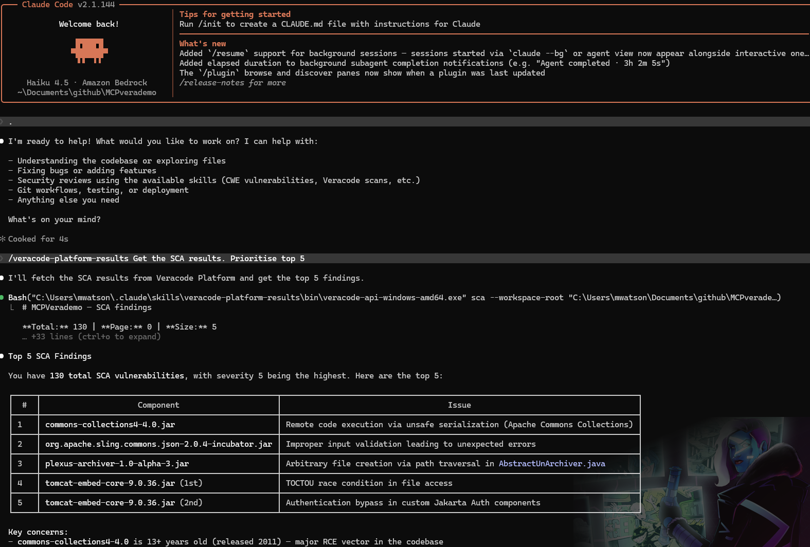
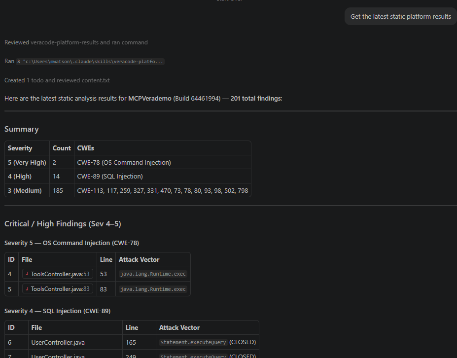

# veracode-platform-results

A reusable agent skill + scripts pattern for querying and interpreting [Veracode platform](https://docs.veracode.com/) SAST, DAST, and SCA results via the Findings API.

Works with GitHub Copilot, Cursor, Claude Code, and any agent that supports the `SKILL.md` convention.

## What it does

- Fetches **SAST** findings from platform static analysis scans
- Fetches **DAST** findings from dynamic analysis scans
- Fetches **SCA** findings (open-source component vulnerabilities)
- Retrieves **scan/build metadata** including policy compliance status and analysis units
- Retrieves detailed flaw data including data-flow paths for SAST and HTTP traces for DAST
- Supports filtering by severity, CWE, new findings, policy violations, sandbox, and more

Example agent workflows using the skill:

Claude Code:



VS Code:



The provided API bridge used to access the REST/XMLVeracode API comes from [https://github.com/dipsylala/veracode-api](https://github.com/dipsylala/veracode-api)

## Installation

### Install with npx skills

Use [npx skills](https://github.com/vercel-labs/skills) to install directly into your coding agent(s):

```bash
# Install to all detected agents (interactive)
npx skills add dipsylala/veracode-platform-results

# Install globally (available across all projects)
npx skills add dipsylala/veracode-platform-results -g

# Install to a specific agent non-interactively
npx skills add dipsylala/veracode-platform-results -a claude-code -y
```

### GitHub Copilot, Cursor, and other AI IDEs

Copy or clone this folder into your project (or home directory for personal use):

| Location | Scope |
| ---------- | ------- |
| `.github/skills/veracode-platform-results/` | Project — GitHub Copilot |
| `.agents/skills/veracode-platform-results/` | Project — other agents |
| `.claude/skills/veracode-platform-results/` | Project — Claude/Cursor |

## Usage

The agent will automatically load the skill when relevant, or you can invoke it directly:

> "Show me all High and Very High SAST findings for MyApp"

> "Give me SCA findings for MyApp that violate policy"

> "Get details on flaw 12345 in MyApp"

## Requirements

- Veracode API credentials — either `~/.veracode/veracode.yml` (`api.key-id` / `api.key-secret`) or environment variables `VERACODE_API_ID` / `VERACODE_API_KEY`
- The API base URL is auto-detected from the key prefix: keys starting with `vera01ei-` use `https://api.veracode.eu`; all others use `https://api.veracode.com`. Override with `VERACODE_OVERRIDE_API_BASE_URL` or `api.override-api-base-url` in the YAML.
- On macOS and Linux: `chmod +x` the binary before first use

## Repository contents

| Path | Description |
|------|-------------|
| `SKILL.md` | Skill definition and agent instructions |
| `bin/veracode-api-windows-amd64.exe` | Pre-built binary — Windows (x64) |
| `bin/veracode-api-windows-arm64.exe` | Pre-built binary — Windows (ARM64) |
| `bin/veracode-api-darwin-amd64` | Pre-built binary — macOS (Intel) |
| `bin/veracode-api-darwin-arm64` | Pre-built binary — macOS (Apple Silicon) |
| `bin/veracode-api-linux-amd64` | Pre-built binary — Linux (x64) |
| `bin/veracode-api-linux-arm64` | Pre-built binary — Linux (ARM64) |

## Remediation priority

1. **Very High** — fix immediately; likely exploitable
2. **High** — fix in current sprint; exploitability is neutral or likely
3. **Medium / Low** — schedule for remediation; lower exploitability risk
